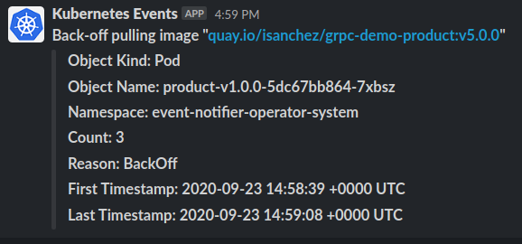

# event-notifier-operator

A simple Kubernetes Operator that sends events to Slack.

<p align="center">
  
</p>

## Requirements

 - Go 1.13
 - operator-sdk 1.0.0
 
## Slack

For information about how to create a bot user check the Slack docs: https://api.slack.com/authentication/basics

You will need the bot user token and the channel ID where the operator will post messages.

## Build and Usage

Change the namespace where the operator is intended to be run. This namespace will be monitored for Kubernetes Events:

```shell
$ cd config/default/ && kustomize edit set namespace "mynamesapce" && cd ../..
```

Build:

```
$ make docker-build docker-push IMG=quay.io/youruser/event-notifier-operator:v0.0.1
```

- Register CRD in Kubernetes:

```
$ make install
```

- Deploy the operator. This will also install the RBAC manifests from config/rbac.

```
$ make deploy IMG=quay.io/youruser/event-notifier-operator:v0.0.1
```

- Register new notifications, for example:

```
$ kubectl apply -f config/samples/eventnotifier_v1_slacknotification.yaml -n mynamespace
```

```
apiVersion: eventnotifier.drhelius.io/v1
kind: SlackNotification
metadata:
  name: slacknotification-sample
spec:
  token: 'xoxb-YOUR_TOKEN'
  channel: '#YOUR_CHANNEL'
  regex: '.*Back-off pulling image.*'
  resources:
    - Pod
```
